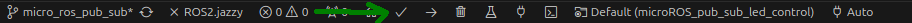
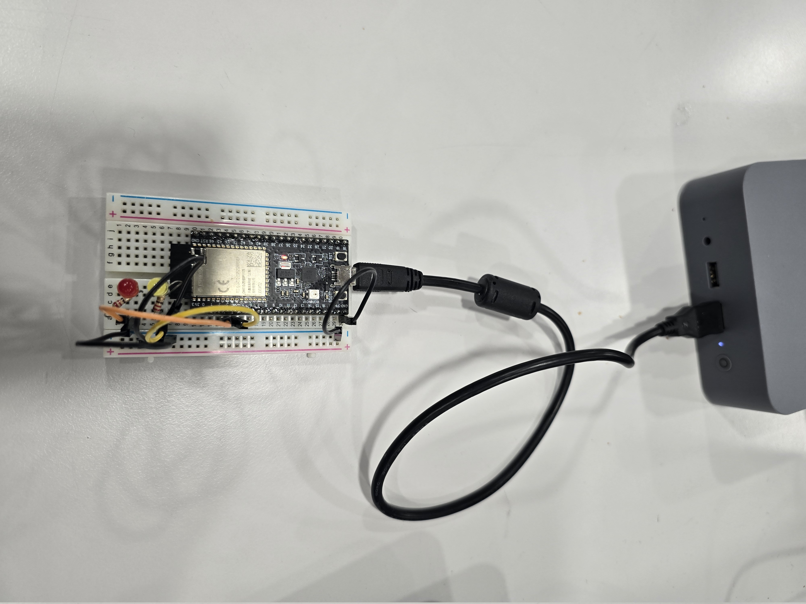
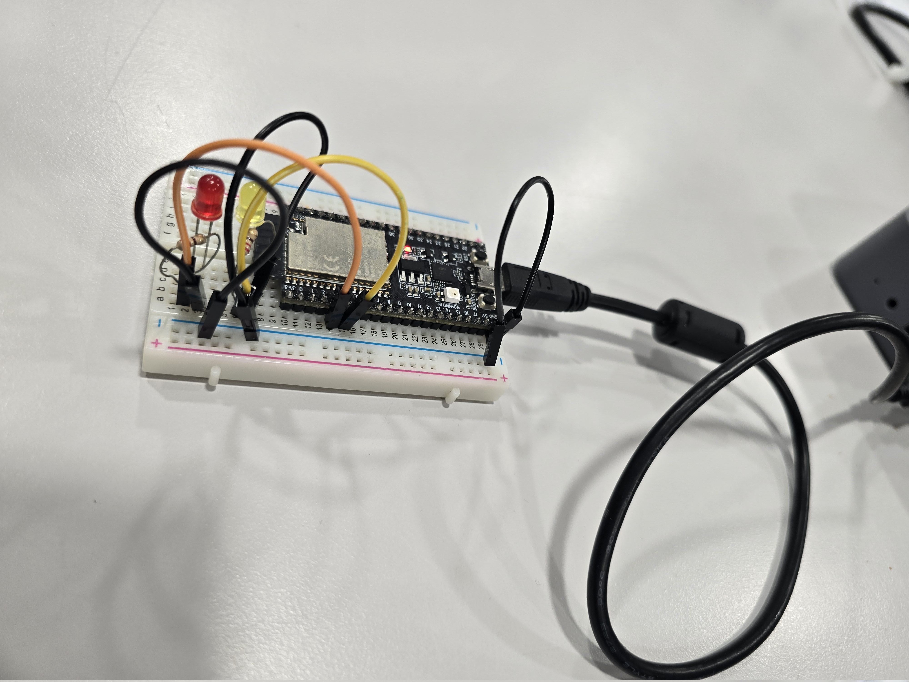

# ros_social_robot_prototype


## Project todolist

1. Proof that we have a technical working robot with some sensors and actuators using the robot model (LLD -> HLD -> basic controller). Drivers for the following sensor en actuators should be implemented:
- [ ] Camera(s) 
    - [x] LLD
    - [x] HLD (Mocked version)
    - [ ] Real HLD (Later in project)
- [ ] Radar(s)
- [ ] Microphone
- [ ] Speaker
- [ ] Ledmatrix RGB
- [ ] LCD screen(s)
2. Define the real controller behaviour for this project with projectmananger and implement this.
3. Write about project and how to use it.


# GENERAL
Building this project should be done in the ros2_ws directory

```bash
cd ros2_ws
```

Add sourcing to your shell startup script.
```bash
echo "source /opt/ros/jazzy/setup.bash" >> ~/.bashrc
```

## Table of Content

1. [How to build project without tests](#how-to-build-project-without-tests-fast-build)
2. [How to build project with testing](#how-to-build-project-with-testing)
3. [How to build one package specific](#how-to-build-one-package-specific)
4. [Run tests](#run-tests)
5. [Run test for one package](#run-test-for-one-package)
6. [Configuration for serial port access](#configuration-for-serial-port-access-needed-for-flashing-to-mcu)
7. [Platform IO setup for ubuntu](#platform-io-setup-for-ubuntu)
8. [Arduino IDE setup for ubuntu](#arduino-ide-setup-for-ubuntu)
9. [Brief Steps for micro-ros agent setups](#brief-steps-for-micro-ros-agent-setups)
10. [Steps to run micro-ros node successfully](#steps-to-run-micro-ros-node-succsfully)
11. [Adding Custom messages types or Custom micro-ROS packages](#adding-custom-messages-types-or-custom-micro-ros-packages-to-micro_ros_platformio)
12. [Micro-ros pub_sub_led_control example / proof of concept](#micro-ros-pub_sub_led_control-example--proof-of-concept)


# How to build project without tests (Fast build)
```bash
colcon build --cmake-args -DBUILD_TESTING=OFF
```

# How to build project with testing

```bash
 colcon build
```

OR

```bash
colcon build --cmake-args -DBUILD_TESTING=ON
```
## How to build one package specific
An example with camera_hld package
```bash
 colcon test --packages-select camera_hld
```
Building the project this way will include unittest and cppcheck.

## Run tests

step 1 run tests:
```bash
  colcon test
```
step 2 see results (path to xml files will be given): 
```bash
  colcon test-result --all
```

## Run test for one package

An example with the package camera_hld

step 1 run test:
```bash
  colcon test --packages-select camera_hld
```
step 2 see results (path to xml files will be given):
```bash
  colcon test-result --all
```

# Configuration for serial port access (needed for flashing to MCU)

Most likely by default your system does not have read and write acces to the serial port. In the following steps we will obtain these rights. 

There are multiple ways to gain read and write access to the serial port, we will use the most "simple" way.

1. Find your (desired) serial port. This is most likely the one that is currently connected. We can find this with:
```bash
  sudo dmesg | grep tty
```
In my case the microcontroller was connectect to ttyUSB0

2. Identify which group owns the file corresponding to the serial port communication:
```bash
  ls -l /dev/ttyUSB0
  
  # prints something like:
  # crw-rw---- 1 root dialout 188, 0 Oct 28 08:54 /dev/ttyUSB0
```

3. Add your self to the group corresponding to the serial port communication. In my case the group name was "dialout.Typical names are “dialout”, “plugdev” (Debian/Ubuntu, Fedora), or “uucp” (Arch Linux). Adding a user to a group is done by:
```bash
  sudo usermod -a -G dialout $USERNAME
```

**NOTE** **&#9432;**
You will need to log out and log back in again (or reboot) for the user group changes to take effect.


# Platform IO setup for ubuntu

1. sudo apt install -y git cmake python3-pip
2. sudo apt install python3-venv
3. install the platform io extension: search this in the extension bar in VSstudio code (ctrl+P) -> "ext install platformio.platformio-ide"    

**NOTE** **&#9432;**
To be able to flash to a MCU from platform IO, we need read and write access to the serial port. 
Follow the steps from the "Configuration for serial port access" section to gain these rights. 

Alternatively install [udev][1] rules for PlatformIO supported boards/devices. Adding udev rules for platformIO can be found [here][2] in the section "99-platformio-udev.rules". 

[1]: https://en.wikipedia.org/wiki/Udev            "udev"
[2]: https://docs.platformio.org/en/latest/core/installation/udev-rules.html           "here"

# Arduino IDE setup for ubuntu

1. Download the latest release (AppImage)

2. Find the AppImage file in your file manager.

3. Make the AppImage file executable:
  Right-click the file.
  Choose Properties,
  Select the Permissions.
  Tick the Allow executing file as program box.
  Double-click the AppImage file to launch Arduino IDE.

In case you cannot run the AppImage file, make sure that FUSE is installed on your system.

```bash
sudo add-apt-repository universe
sudo apt install libfuse2
```

**NOTE** **&#9432;**
To be able to flash to a MCU from Arduino IDE, we need read and write access to the serial port. 
Follow the steps from the "Configuration for serial port access" section to gain these rights. 

Alternatively add [udev][1] rule for Arduino IDE. To enable the Arduino IDE to access the serial port and upload code to your board, the following rule can be added to /etc/udev/rules.d/99-arduino.rules.

```bash
  SUBSYSTEMS=="usb", ATTRS{idVendor}=="2341", GROUP="“dialout”", MODE="0666"
```

# Brief Steps for micro-ros agent setup
TODO NOT DONE YET

For now brief description

```bash
sudo apt install python3-rosdep
sudo rosdep init
rosdep update && rosdep install --from-paths src --ignore-src -y
```

# Steps to run micro-ros node succsfully
For now brief description

1. Stop micro-ros agent (especilly if it uses the serial port, because this occupies the port and therefor we can't flash!)
2. flash firmware to mcu
3. Start micro-ros agent
4. Press the reboot button of MCU.

Now we can see node and topic's from the MCU.


# Adding Custom messages types or Custom micro-ROS packages (to micro_ros_platformio)
Whenever a new colcon package is added the platformio project should then be build from scratch.
This can be done with the following steps:
1. Remove the .pio directory 
2. Build the project with PlatformIO:Build, see image below with which icon.




Colcon packages can be added to the build process using one of the methods:

### Method 1 Copy package
Package directories copied on the `<Project_directory>/extra_packages` folder.

Example abstract:
```bash
cp -r /path/to/your/ros_package /path/to/platformio_project/extra_packages/
```

Example in my case:
```bash
cd ~/ros_social_robot_prototype/ros2_ws/src #Go to the src directory of the ros2_ws 
cp -r my_custom_led_interface/ microROS_pub_sub_led_control/extra_packages/ #Copy the package.
```

### Method 2 Include external git repro (github example)
Git repositories included on the `<Project_directory>/extra_packages/extra_packages.repos` yaml file.

Example in my case (let's say we want to use example_interface package from ros2)

```bash
cd /path/to/platformio_project/ #Go to your platform io project (navigate to the root directory)
mkdir extra_packages #If you don't have a extra_packages directory in the root of the platform io project, create one.
cd extra_packages
nano extra_packages.repos #Create a .repos file (content: Yaml)
```
Add the following content in the extra_packages.repos:
```yaml
repositories:
  example_interfaces:
    type: git
    url: https://github.com/ros2/example_interfaces
    version: jazzy
```

With this setup platformio will download (using vcstool internally) the package using git.

### Method 3 Include internal git repro (experimantal)
It is possible that the package we want use is not aviable on the internet and is package we have created our own.
Instead of copying using method 1. We could use git to pull from a local directory. 

To be able to do this the target package must be a local repository.
The example below shows how we create a local repository 
```bash
cd ~/ros_social_robot_prototype/ros2_ws/src/my_custom_led_interface
git init #Create (local) git repository
git add . #Add current package
git commit -m "A commit message needed to publish the package to the local repro"
```

Create .repos file in the extra_packages directory if this is not done:
```bash
cd /path/to/platformio_project/ #Go to your platform io project (navigate to the root directory)
mkdir extra_packages #If you don't have a extra_packages directory in the root of the platform io project, create one.
cd extra_packages
nano extra_packages.repos #Create a .repos file (Content: Yaml)
```

Add the following content in the extra_packages.repos:
```yaml
repositories:
  my_custom_led_interface:
    type: git
    url: file:///home/hcl/ros_social_robot_prototype/ros2_ws/src/my_custom_led_interface
    version: master
```
**NOTE** **&#9432;** Method 3 requires that each package need to have a local git repro. This could be improved by having every package in one local git repro, or having script which does the manual process. For now we create git repro manually for each desired package, due to the time constraint of the current project.


# Micro-ros pub_sub_led_control example / proof of concept

To proof we can create a ros node for the esp32 a example project is made with micro-ros.
For this project micro-ros, platformio and the arduino-framework is used.

The essential functionality of a ROS application are shown in this project:
1. We have a timer that triggers a publisher.
2. We have a publisher that publishes on the topic "/led_status" the state of LEDs (example "data: Red LED is On and Yellow LED is On. Brightness value for all LED is 10")
2. We have a subscriber that listen on the topic "/led_brightness". With this topic we can configure the brightness of all LEDs (range 0-255).
3. We have a service with a custom message ROS message where we can toggle the red an yellow LED on and off for (brightness) control.


Some parameters for this node can be configured compile time. The parameters can be found in config_example.ini. 
To use the parameters: Create a file "config.ini" with the same contents of config_example.ini. config.ini will always be used and not be pushed to git, this way your configruation will stay private :).

The project can be found in the [microROS_pub_sub_led_control package](./ros2_ws/src/microROS_pub_sub_led_control/)
The source code of this project can be found here [src](./ros2_ws/src/microROS_pub_sub_led_control//src/main.cpp)

When building this project the parameters will be automatically loaded with the pythonscript "load_config.py". The configuration file config.ini will always be used.

1. Add my_custom_led_interface package to the extra_packages: [Adding Custom messages types or Custom micro-ROS packages](#adding-custom-messages-types-or-custom-micro-ros-packages-to-micro_ros_platformio)
2. Remove .pio directory in the microRos_pubs_sub_led_control directory.
3. Wire your setup, see: [Wiring setup](#wiring-setup). And connect the esp32 to your pc.
4. Build and flash to the eps32.
5. Start micro-ros agent
6. Reboot esp32 with rst button.
7. Try the example

## Example usage of topics and service
Whenever you open a new terminal don't forget to source your directory.
```bash
source install/setup.bash #do this in the ros2_ws directory
```

Listen to publishing topic:
```bash
ros2 topic echo /led_status
```

Publish to subscribing topic:
```bash
ros2 topic pub --once /led_brightness std_msgs/msg/UInt8 "{data: 180}" #Set brightness of all LEDs to 180
```

Control the LED with a service:
```bash
#led_color options are 1 or 2. 1 = red, 2 = yellow
#led_on options are True to set the desired color on and False to turn it off
ros2 service call /control_led my_custom_led_interface/srv/MyCustomLedControl "{led_color: 2, led_on: True}"
```

## Wiring setup




| ESP32                                        | Usage      |
| -------------------------------------------- | ------------- |
| `Pin 3`                                      | `Connected to Red LED with orange jumpwire. 220ohm resistor is used.`     | 
| `Pin 4`                                      | `Connected to Yellow LED with yellow jumpwire. 220ohm resistor is used.`      | 
| `GND`                                        | `Connected to all LEDs with black wire.`      |
|

