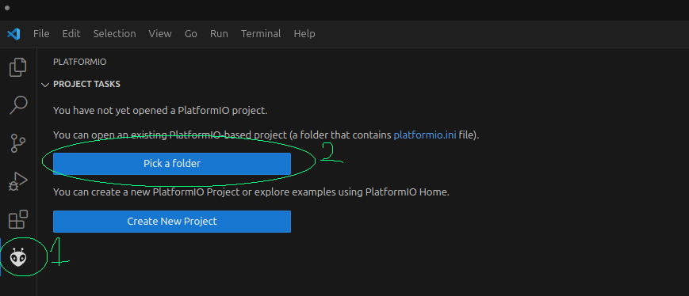
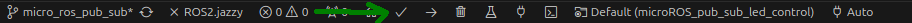
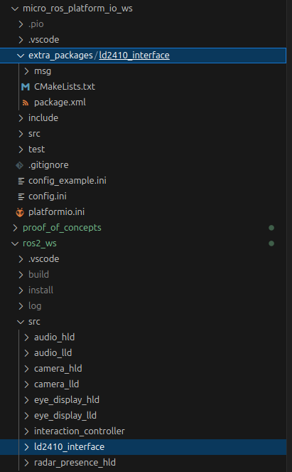
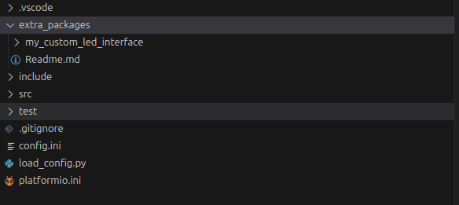

# ros_social_robot_prototype
Welcome to the `ros_social_robot_prototype` repository.

This repository contains the software for the HCL-robot, internally referred to as **Mika** or **BuddyBot**.  
It includes ROS 2 nodes, micro-ROS nodes, documentation, and proof-of-concept demos for various components.

---
## Project Structure

| Folder                              | Description |
|-------------------------------------|-------------|
| [`micro_ros_agent`](./micro_ros_agent/) | Contains the software and setup instructions for the Micro-ROS agent. This agent acts as a bridge between micro-ROS nodes and ROS 2 nodes. |
| [`ros2_ws`](./ros2_ws/) | ROS 2 workspace containing all the standard ROS nodes for the robot. |
| [`micro_ros_platform_io_ws`](./micro_ros_platform_io_ws/) | PlatformIO workspace containing micro-ROS nodes. Currently has the `ld2410_manager_node` for ESP32-S3 as a radar low-level driver. |
| [`docs`](./docs/) | Contains the Software Requirements Specification (SRS) and Software Design Description (SDD). |
| [`proof_of_concepts`](./proof_of_concepts/) | A collection of PoCs that explore specific technologies or integrations used in the robot. |

Each folder contains its own `README.md` with usage instructions and relevant information.

--- 

## Prerequisites

## ROS 2 Jazzy jalisco
ROS2 jazzy jalisco is needed for the ros nodes and to install the correct version of micro-ros. Installation guide: [ROS Jazzy Installation Guide](https://docs.ros.org/en/jazzy/Installation/Ubuntu-Install-Debs.html)

After the installation DO NOT FORGET to source the ros installation to bashrc, this way the command line tools of ros2 are alway available in a (new) terminal shell.

```bash
echo "source /opt/ros/jazzy/setup.bash" >> ~/.bashrc
```

---

### Micro ros agent

See [micro_ros_agent/README.md](./micro_ros_agent/README.md) for setup and usage instructions.

---

### Serial Port Access (for microcontrollers)

To flash microcontrollers via USB, you need read/write access to the serial port.

Most likely by default your system does not have read and write acces to the serial port. In the following steps we will obtain these rights. 

There are multiple ways to gain read and write access to the serial port, we will use the most "simple" way.

1. Find your (desired) serial port. This is most likely the one that is currently connected. We can find this with:
```bash
  sudo dmesg | grep tty
```
In my case the microcontroller was connectect to ttyUSB0

2. Identify which group owns the file corresponding to the serial port communication:
```bash
  ls -l /dev/ttyUSB0
  
  # prints something like:
  # crw-rw---- 1 root dialout 188, 0 Oct 28 08:54 /dev/ttyUSB0
```

3. Add your self to the group corresponding to the serial port communication. In my case the group name was "dialout.Typical names are “dialout”, “plugdev” (Debian/Ubuntu, Fedora), or “uucp” (Arch Linux). Adding a user to a group is done by:
```bash
  sudo usermod -a -G dialout $USERNAME
```

**NOTE** **&#9432;**
You will need to log out and log back in again (or reboot) for the user group changes to take effect.


---


## Platform IO setup (for building micro-ROS firmware)
Platform IO is needed to build and flash a micro-ros node for a microcontroller. The following is needed to have platform io running.
1. Install visual studio code. Installtion guide for linux can be found [here](https://code.visualstudio.com/docs/setup/linux).
2. Install following packages:
```bash
sudo apt install -y git cmake python3-pip
sudo apt install python3-venv
```

3. Install the platform io extension: search this in the extension bar in VSstudio code (ctrl+P) -> "ext install platformio.platformio-ide"    

**NOTE** **&#9432;**
To be able to flash to a MCU from platform IO, we need read and write access to the serial port. 
Follow the steps from the "Configuration for serial port access" section to gain these rights. 

Alternatively install [udev][1] rules for PlatformIO supported boards/devices. Adding udev rules for platformIO can be found [here][2] in the section "99-platformio-udev.rules". 

[1]: https://en.wikipedia.org/wiki/Udev            "udev"
[2]: https://docs.platformio.org/en/latest/core/installation/udev-rules.html           "here"

---

## Open a project with platform IO (for microcontroller)
See the image below how to open a project with platform io:



---

## Adding Custom messages types or Custom micro-ROS packages (to micro_ros_platformio)
Whenever a new colcon package is added the platformio project should then be build from scratch.
This can be done with the following steps:
1. Remove the .pio directory 
2. Build the project with PlatformIO:Build, see image below with which icon.




Colcon packages can be added to the build process using one of the methods:

### Method 1 Copy package
Package directories copied on the `<Project_directory>/extra_packages` folder.

Example abstract:
```bash
cp -r /path/to/your/ros_package /path/to/platformio_project/extra_packages/
```

Example in the case of [our prototype](./micro_ros_platform_io_ws/) :
```bash
cd ~/ros_social_robot_prototype/ros2_ws/src #Go to the src directory of the ros2_ws 
cp -r ld2410_interface/ ../micro_ros_platform_io_ws/extra_packages/ #Copy the package.
```
Will result in:


Example in the case of [micro-ros-proof-of-concept-example](./proof_of_concepts/proof_of_concept_micro_ros/):
```bash
cd ~/ros_social_robot_prototype/proof_of_concepts/proof_of_concept_micro_ros/ros_ws/src/  
cp -r my_custom_led_interface/ ../../micro_ros_ws_platform_io/extra_packages/ #Copy the package.
```
Will result in:



--- 
### Method 2 Include external git repro (github example)
Git repositories included on the `<Project_directory>/extra_packages/extra_packages.repos` yaml file.

Example in my case (let's say we want to use example_interface package from ros2)

```bash
cd /path/to/platformio_project/ #Go to your platform io project (navigate to the root directory)
mkdir extra_packages #If you don't have a extra_packages directory in the root of the platform io project, create one.
cd extra_packages
nano extra_packages.repos #Create a .repos file (content: Yaml)
```
Add the following content in the extra_packages.repos:
```yaml
repositories:
  example_interfaces:
    type: git
    url: https://github.com/ros2/example_interfaces
    version: jazzy
```

With this setup platformio will download (using vcstool internally) the package using git.

--- 

## Flashing a Micro-ROS Node (Checklist)

1. Stop the micro-ROS agent if it uses the serial port (especilly if it uses the serial port, because this occupies the port and therefor we can't flash!).
2. Flash the firmware via PlatformIO.
3. Start the micro-ROS agent again.
4. Press the reset button on your microcontroller.

You should now see topics and nodes from the MCU via `ros2 topic list` or `ros2 node list`.


