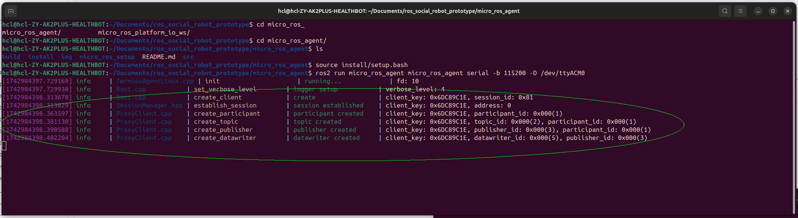

# Platform io workspace - micro_ros low level radar


This project contains a micro-ROS application built with PlatformIO for the **ESP32-S3** microcontroller. It is designed to interface with an **HLK-LD2410** radar sensor, read presence and motion data, and publish it to a ROS 2 system via micro-ROS. 

---

## Project Overview

The `ld2410_node` in this workspace:
- Communicates with the **HLK-LD2410** radar sensor over UART.
- Dynamically loads project settings from a `config.ini` file.
- Publishes sensor data using custom micro-ROS message every second.

## Requirements

- PlatformIO CLI or Visual Studio Code with the PlatformIO extension
- ESP32-S3 development board (tested with ESP32-S3-WROOM)
- HLK-LD2410 radar sensor(s) connected via UART
- ROS 2 jazzy with micro-ROS agent installed

## Testing the Micro-ROS Node – Step-by-Step
This section explains how to build, flash, and run the micro-ROS node that interfaces with the LD2410 radar sensor.

### Prerequisites

Make sure you've followed the setup steps in the root [README](../README.md), including installation of PlatformIO and the micro-ROS agent.

### Project structure

```
micro_ros_platform_io_ws/
├── platformio.ini                 # PlatformIO configuration
├── config_example.ini             # Example config file for the this project
├── src/
│   └── ld2410_node/               # Main source code for the radar node
│       ├── presence_sensing.cpp   # Main application logic
│       ├── load_config.py         # Loads the config.ini file into the application
│       ├── config.ini             # Active config for Wi-Fi and serial settings
│       └── ...                    # Other source and header files
├── extra_packages/
    └── ld2410_interface/          # Custom micro-ROS message definitions
```

### Build and Flash Instructions

1. **Copy the interface package:**  
   If not already present, copy the [`ld2410_interface`](../ros2_ws/src/ld2410_interface/) folder into the [`extra_packages`](./extra_packages/) directory.  
   Ensure it matches the interface definition in your ROS 2 workspace.

2. **Open this folder in PlatformIO.**

3. **(Optional) Clean build:**  
   Delete the `.pio/` folder if it exists to ensure a clean build—especially when updating or adding message definitions.

4. **Configure the development board:**  
   Edit `platformio.ini` and ensure your board is set (default: `esp32-s3-devkitc-1`).

5. **Set the transport type (default: `serial`):**  
   ```ini
   board_microros_transport = serial
   ```
6. **Create a `config.ini` file:**  
   Duplicate `config_example.ini` and rename it to `config.ini` inside `src/ld2410_node/`. Adjust Wi-Fi and UART settings as needed.

7. [Build and flash the ESP32](../README.md#adding-custom-messages-types-or-custom-micro-ros-packages-to-micro_ros_platformio).

8. **Close PlatformIO's serial monitor** if it's open — especially when using serial transport.

9. **Start the micro-ROS Agent on your PC:**  
   Follow the steps in [micro_ros_agent/README.md](../micro_ros_agent/README.md#running-the-micro-ros-agent).

If everything is working, you should see log messages similar to the following screenshot:



### ROS 2 Topic Echo
10. Open a new terminal and go to your ROS 2 workspace:

```bash
cd ../ros2_ws
```
11. Build the custom interface:

```bash
colcon build --packages-select ld2410_interface
```

12. Source the workspace:

```bash
source install/setup.bash
```

13. Echo the radar topic:

```bash
ros2 topic echo /ld2410_target_frames
```
---

