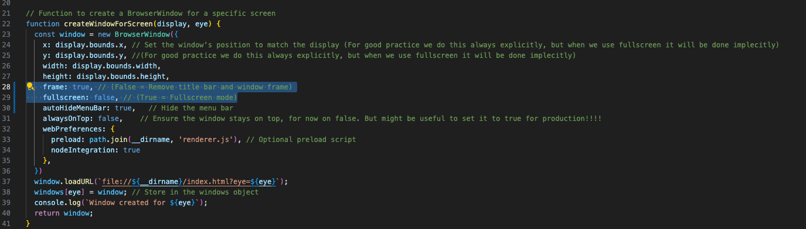
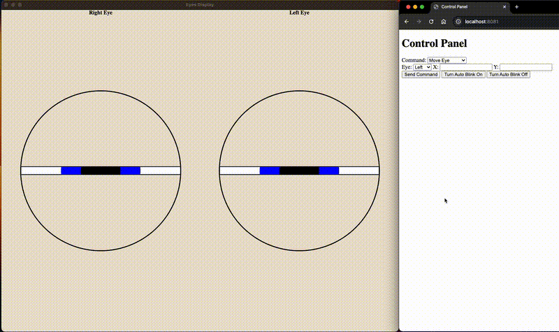

# Proof of Concept: Eye Visualization using Electron (New)

This project demonstrates a proof-of-concept for visualizing and controlling eyes using Electron. The application creates a fullscreen window(s) displaying both eyes and allows interaction using predefined controls.

The styling of the app is done using SASS to reuse variables and simplify CSS management. SASS is automatically compiled into `styles.css`, which is used by the app.

Note: The app has numerous console logs for debugging purposes. Console logs from main.js can be viewed in the terminal, while logs from renderer.js can be accessed in the Developer Tools console. To open Developer Tools, focus on the application window and press `CTRL+SHIFT+I`, then navigate to the "Console" tab.

## Core Functionality
- Detect if one or two screen are conncteded.
- **Single-screen setup:**  
    - A fullscreen window displays both eyes, with labels above each eye for demonstration purposes.
    - The screen will be divided in two equal sections:
        - **Left side** of the screen will display the right eye. (Robot's perspective)
        - **Right side** of the screen will display the left eye. (Robot's perspective)
- **Dual-screen setup:**  
- Each screen gets a fullscreen window displaying one eye.
- When two screens are conntected each screen will get a fullscreen window with one eye.
    - The primary screen displays the **right eye**.
    - The secondary screen displays the **left eye**.
- Mouse movement tracking (to simulate face/target tracking).
- A control panel as a webclient to manipulate the eyes:
    - Turn off and on the (automatic) periodic blinking of the eyes.
    - Move each eye independently or both simultaneously to a x y (pixel) position.
    - Move each eyelid OR all eyelids simultaneously in percenteges to a position.
        - For Example: Top left : 50% means that the upper left eye lid will cover half of the eye.
    - Playing (preprogrammed) animation (defined in CSS):
        - Blink (once fast).
        - Sad expression.
        - Grin expression.
        - Look Random directions.
    - Reset command to set the eyes to it's default position.
 - Control panel can be accest on: "http://localhost:8081". (hardcoded)
 - A webserver (in the eyes app) that can receive input from the control panel.
    - The webserver listens on port **8080**. (hardcoded)
    

## App configuration

### Styling
- **Eye size:**
    - Configurable in `styles.scss` (line 10) using the `$eye-size` variable.
    - Currently, each eye is set to take up 40% of the largest screen dimension.
- **Background color:**
    - Configurable in `styles.scss` (line 3) using the `$bg` variable.
    - Default: "beige".

## Application Settings
- To enable fullscreen mode and hide the title bar, set the `frame` property to `false` and `fullscreen` to `true` in main.js.
    - In the screenshot below you can see the current settings for a window. The highlighted section should be changed to run "truly" in fullscreen mode without titlebar.
    -  

## Installation Steps

### Prerequisites

Ensure the following tools are installed on your system:

- **curl**
```bash
sudo apt update && sudo apt upgrade -y # Update package manager
sudo apt install curl -y # Install curl
```

- **Node.js (version 22), nvm and npm**:
```bash
# Download and install nvm:
curl -o- https://raw.githubusercontent.com/nvm-sh/nvm/v0.40.1/install.sh | bash
#Re-read bashrc OR restart terminal
source ~/.bashrc 
# Download and install Node.js:
nvm install 22
# Verify the Node.js version:
node -v # Should print "v22.13.0".
nvm current # Should print "v22.13.0".
# Verify npm version:
npm -v # Should print "10.9.2".
```

- **Install required dependencies for this project**:
```bash
npm install # Installs the required dependencies for this project
```


## Run the app


**To run the app in production mode:**
```bash
npm start
```

**To run the app in development mode:**
```bash
npm run dev
```
**Running the app in development mode enables "hot reload" for file changes, such as SASS/CSS updates, without manually restarting the app.**

## Example

The GIF below demonstrates the application running with both eyes displayed on one screen. The control panel is accessible via any browser at http://localhost:8081.

**Note:** If the app restarts, you need to manually refresh the browser page to reconnect to the server.



*Duration of gif = 1 min 52 seconds*

## Possible future improvements
This section outlines potential improvements for the app. These suggestions are written as a checklist. This codebase will serve as the foundation for the low-level eye driver of the "ros_social_robot_prototype". Checked items will be added to the prototype.

- [x] Make random animations "truly random" by calculating positions dynamically using JavaScript instead of SASS (SASS precompiles values into CSS, the position are calculated once!).

- [x] add a "sleepy" eye animation.
- [x] Add a "close all eyes" command.
- [x] Add an "awake/open eyes" command.
- [x] Rewrite the codebase in TypeScript for compile-time and type checking.

- [ ] When touch functionality will be integrated in another project. Don't forget to disable zoom in and scrolling with javascript (for touch device)! Because zooming in a eye is prorabably not a desired functionalty.
No code is written for enabling/disabling touch. I don't know what the default is. This was not in my scope. Just reminding some logic needed to be added for this.