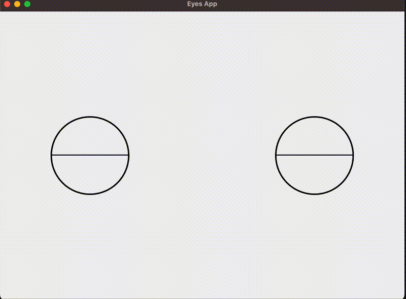

# Proof of Concept: Eye Visualization using Electron

This project demonstrates a proof-of-concept for visualizing and controlling eyes using Electron. The application creates a fixed window displaying both eyes and allows interaction using predefined controls.

## Installation Steps

### Prerequisites

Ensure the following tools are installed on your system:

- **curl**
```bash
sudo apt update && sudo apt upgrade -y # Update package manager
sudo apt install curl -y # Install curl
```

- **Node.js (version 22), nvm and npm**:
```bash
# Download and install nvm:
curl -o- https://raw.githubusercontent.com/nvm-sh/nvm/v0.40.1/install.sh | bash
# Download and install Node.js:
nvm install 22
# Verify the Node.js version:
node -v # Should print "v22.13.0".
nvm current # Should print "v22.13.0".
# Verify npm version:
npm -v # Should print "10.9.2".
```

- **Install required dependencies for this project**:
```bash
npm install # Installs the required dependencies for this project (which is in this case only electron js)
```


## Run the app
The app will launch in a window with a fixed size (800x600) and display both eyes. The eyes will blink periodically and will follow mouse movement. 

To run the app:
```bash
npm start
```

## Example

The GIF below demonstrates the application running with both eyes displayed in a fixed-size window of 800x600.



*Duration of gif = 33 seconds*