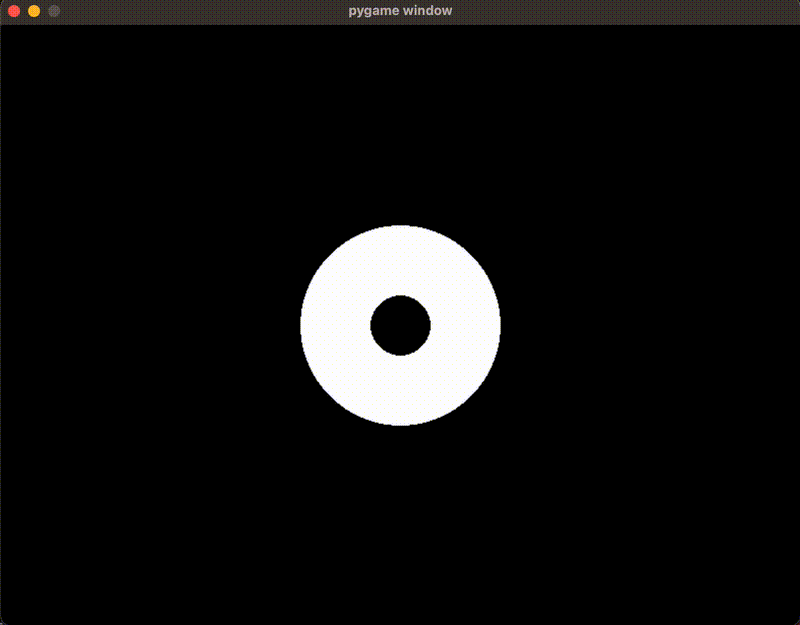

# Proof of Concept: Eye Visualization in Python

This project demonstrates how to visualize and control eyes using Python and keyboard input. It supports multiple screens (up to 2) and allows dynamic control of the iris position using arrow keys.


## Installation Steps (required)

Ensure you have Python 3, virtual environment tools, and `pygame` installed:

```bash
sudo apt update && sudo apt upgrade -y # Update package manager
sudo apt install python3 python3-pip -y # Intall python3 and pip3
sudo apt install python3-venv -y # Install virtual environment for python
python3 -m venv venv # Create a virtual envoirment named 'venv'
source venv/bin/activate # Activate/open the virtual environment

pip install --upgrade pip # (Optional) Upgrade pip
pip install pygame # Install pygame
```

## Running the scripts

There are two Python scripts in this project:

- ```eyev1.py```: Runs in a fixed window size of 800x600 pixels.
- ```eyev2.py```: Runs in fullscreen mode, scaling the eye visualization to the screen size.

You can control the iris of a eye with keyboard arrows. Both scripts have the second eye commented out, because a second screen is needed for this. 

If a second HDMI screen is connected, uncomment specific lines in the scripts to enable dual-screen support:
- In ```eyev1.py```: Uncomment lines 8, 47, and 51.
- In ```eyev2.py```: Uncomment lines 8, 62, and 66.

### To run the script
```bash
python3 ./eyev1.py 
#or
python3 ./eyev2.py
```

## Example


*eyev1.py (which runs in a fixed windows size of 800x600)* Duration gif: 7 seconds