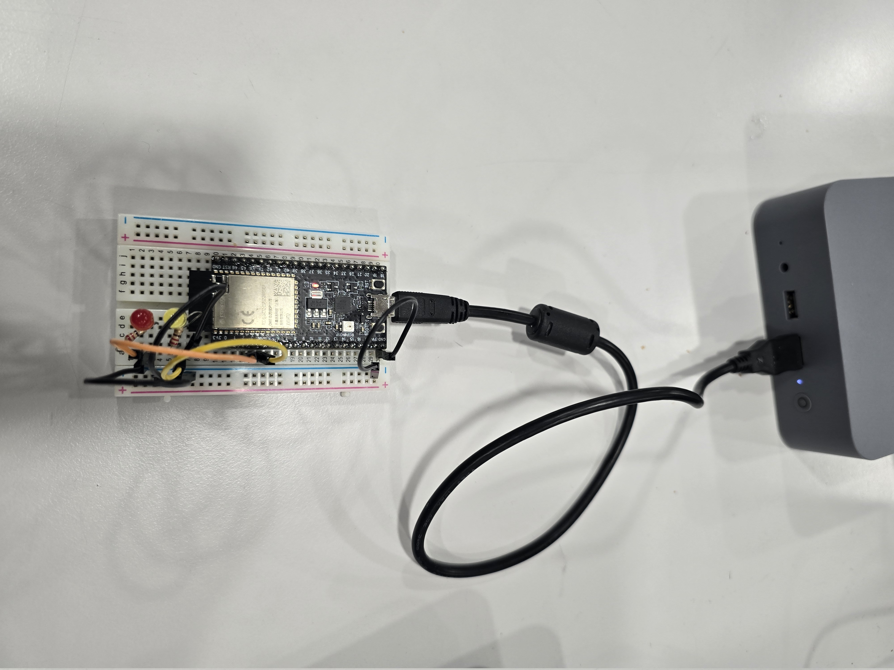
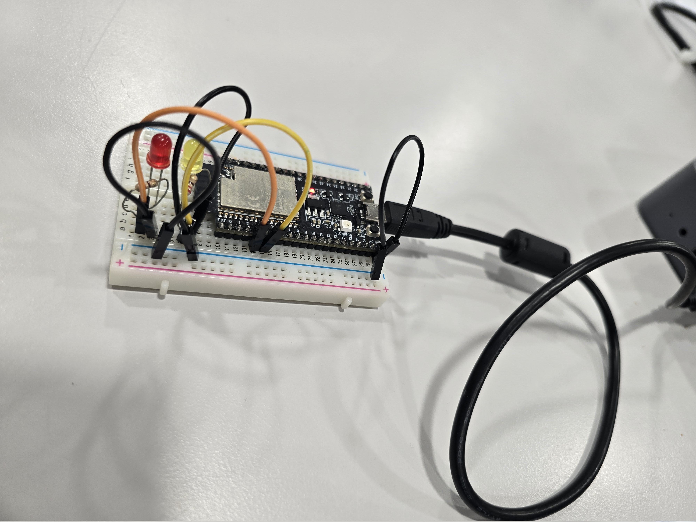
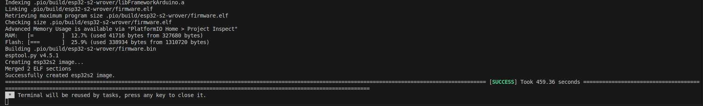

# Micro-ROS pub/sub LED Control Example – Proof of Concept

This project demonstrates how to create a Micro-ROS node for the ESP32 using PlatformIO and the Arduino framework.

The essential functionality of a typical ROS application is implemented:

1. A timer triggers a publisher periodically.
2. A publisher publishes LED states on the `/led_status` topic  
   _(e.g., "data: Red LED is On and Yellow LED is On. Brightness value for all LEDs is 10")_
3. A subscriber listens on the `/led_brightness` topic, which configures brightness for all LEDs (range: 0–255).
4. A service (with a custom ROS message) toggles the red and yellow LEDs on or off.

---

## Structure of This Directory

This folder contains two subfolders:

1. `micro_ros_ws_platform_io/` — The PlatformIO workspace containing the `micro_ros_pub_sub_led_control` application.
2. `ros_ws/` — A minimal ROS 2 workspace containing the custom interface package [`my_custom_led_interface`](./ros_ws/src/my_custom_led_interface/).

---

## Configuration Parameters

Some parameters for the Micro-ROS node can be configured at compile time.  
You’ll find an example configuration in `config_example.ini`.

To use it:

1. Copy `config_example.ini` to `config.ini`.
2. Modify `config.ini` as needed (this file is ignored by Git, so your settings remain private).
3. When building the PlatformIO project, `load_config.py` will automatically load the `config.ini`.

---

## Getting Started – Step-by-Step

1. Copy the [`my_custom_led_interface`](./ros_ws/src/my_custom_led_interface/) package to the [`extra_packages`](./micro_ros_ws_platform_io/microROS_pub_sub_led_control/extra_packages/) directory.
2. Open the [`microROS_pub_sub_led_control`](./micro_ros_ws_platform_io/microROS_pub_sub_led_control/) folder with PlatformIO.
3. Delete the `.pio/` folder if it exists (clean build).
4. Configure your development board in `platformio.ini` (default: ESP32-S2).
5. Set the transport type via `board_microros_transport` in `platformio.ini` (default: serial).
6. Create `config.ini` from the provided `config_example.ini` and modify as needed.
7. Wire your hardware (see [Wiring Setup](#wiring-setup)) and connect the ESP32 to your PC.
8. [Build and flash the ESP32](../../README.md#adding-custom-message-types-or-custom-micro-ros-packages-to-micro_ros_platformio).
9. [Start the Micro-ROS Agent](../../micro_ros_agent/README.md#running-the-micro-ros-agent).
10. Press the reset (RST) button on the ESP32.
11. Try the example.

---

## Example Usage – Topics and Services

> In every new terminal, don’t forget to source ROS:

```bash
source install/setup.bash  # Run this in the ros2_ws directory
```

### Listen to `/led_status`

```bash
ros2 topic echo /led_status
```

### Publish to `/led_brightness`

```bash
ros2 topic pub --once /led_brightness std_msgs/msg/UInt8 "{data: 180}"
```

_(Sets brightness of all LEDs to 180)_

### Call the LED Control Service

```bash
ros2 service call /control_led my_custom_led_interface/srv/MyCustomLedControl "{led_color: 2, led_on: True}"
```

- `led_color`: `1` = Red, `2` = Yellow  
- `led_on`: `True` to turn ON, `False` to turn OFF

---

## Wiring Setup

| ESP32 Pin | Usage |
|-----------|-------|
| `Pin 3`   | Connected to red LED (orange wire, with 220Ω resistor) |
| `Pin 4`   | Connected to yellow LED (yellow wire, with 220Ω resistor) |
| `GND`     | Common ground (black wire to all LEDs) |

### Example Photos




---

## Build Time

Building this project for the first time can take a while due to library downloads and installation.  
On my machine, it took approximately **460 seconds**:

